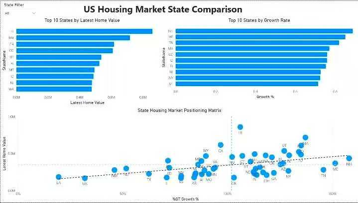

# US Housing Market Power BI Dashboard

Interactive Power BI dashboard designed to analyze U.S. housing market trends, regional price growth, and market performance using Zillow Home Value Index (ZHVI) data.

---

# Project Summary

This dashboard helps business stakeholders monitor housing market performance across the United States by analyzing home value trends, regional growth, state comparisons, and housing market opportunities.

The dashboard provides an executive-level view of housing market conditions to support strategic planning and investment decisions.

---

# Dashboard Preview

## Executive Overview

- Provides a high-level overview of average home value, latest market value, housing price trends, and the fastest-growing housing markets.

---

## State Comparison

- Compares housing market performance across states, including latest home values, growth rates, and market positioning.

---

# Business Problem

Housing market data is often distributed across multiple sources, making it difficult for analysts, investors, and business stakeholders to identify long-term trends and compare regional market performance.

This dashboard consolidates market indicators into a single interactive reporting solution.

---

# Business Questions

- Which housing markets have the highest home values?
- Which states are experiencing the fastest growth?
- How have housing prices changed over time?
- Which regions present investment opportunities?
- Which markets are outperforming the national average?

---

# Key Insights

- Home values increased steadily over the analysis period.
- Several western and coastal markets recorded the highest home values.
- Growth rates varied significantly across states.
- Regional comparisons revealed strong investment opportunities in multiple emerging markets.
- Market performance differs substantially between high-value and high-growth regions.

---

# Data Preparation

- Cleaned and validated housing market data.
- Removed incomplete records.
- Standardized geographic information.
- Built a Power BI data model.
- Created calculated measures using DAX.
- Developed interactive KPIs and trend calculations.

---

# Data Source

- Zillow Home Value Index (ZHVI)
- Zillow Research Housing Data

---

# Tools Used

- Power BI
- Power Query
- DAX
- Excel

---

# Skills Demonstrated

- Dashboard Development
- Data Modeling
- DAX
- Power Query
- Time Series Analysis
- Geographic Analysis
- KPI Design
- Executive Reporting
- Business Storytelling

---

# Business Value

This dashboard enables stakeholders to monitor housing market performance, compare regional trends, identify investment opportunities, and support strategic decision-making with data-driven insights.

---

# Future Improvements

- Integrate mortgage interest rate data.
- Add housing affordability analysis.
- Implement price forecasting using historical trends.
- Connect to live Zillow market updates.
- Develop neighborhood-level market analysis.
