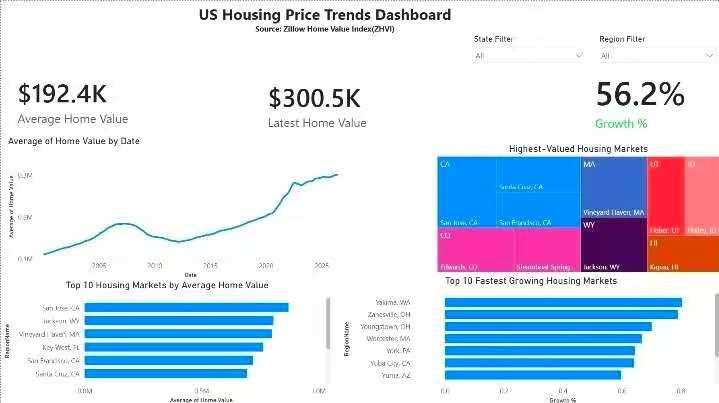

# US Housing Market Power BI Dashboard

Interactive Power BI dashboard for analyzing U.S. housing market trends, regional price changes, affordability, and market performance through interactive visualizations.

---

# Project Summary

This dashboard provides business stakeholders with a centralized view of the U.S. housing market, helping users monitor pricing trends, compare regional performance, and identify opportunities using historical housing data.

---

# Dashboard Preview

## Executive Overview

Provides an executive overview of housing prices, sales activity, affordability metrics, and key market indicators.

---

## Regional Market Analysis

Compares housing prices and market performance across states and metropolitan areas.

---

## Housing Trend Analysis

Analyzes long-term housing price trends, market growth, and seasonal patterns.

---

## Executive Summary & Business Recommendations

Summarizes key findings and provides business recommendations based on housing market trends.

---

# Business Problem

The housing market is influenced by multiple factors including regional demand, pricing trends, affordability, and economic conditions.

Without a centralized dashboard, analysts and stakeholders often rely on multiple reports, making it difficult to identify market trends and compare regional performance efficiently.

---

# Business Questions

- Which states have the highest average home prices?
- How have housing prices changed over time?
- Which regions are experiencing the fastest growth?
- Where are homes becoming less affordable?
- Which markets present potential investment opportunities?

---

# Key Insights

- Housing prices increased steadily across most regions during the analysis period.
- Several metropolitan areas outperformed the national average.
- Affordability declined in high-demand markets.
- Regional differences highlighted opportunities for investment and market expansion.
- Market growth varied significantly across states.

---

# Data Preparation

- Cleaned and validated housing market data.
- Standardized geographic information.
- Built relationships between datasets.
- Created calculated measures using DAX.
- Designed an interactive Power BI data model.

---

# Data Source

Primary Dataset

- U.S. Housing Market Dataset

---

# Tools Used

- Power BI
- Power Query
- DAX
- Excel

---

# Skills Demonstrated

- Data Modeling
- Power Query
- DAX
- Dashboard Design
- Market Analysis
- KPI Development
- Executive Reporting
- Business Storytelling

---

# Business Value

This dashboard enables stakeholders to monitor housing market performance, compare regional trends, evaluate affordability, and support data-driven investment and business decisions.

---

# Future Improvements

- Real-time housing market updates
- Mortgage rate integration
- Forecasting using historical trends
- Neighborhood-level analysis
- Power BI Service deployment
